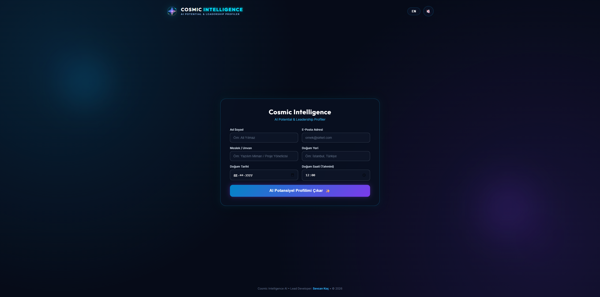
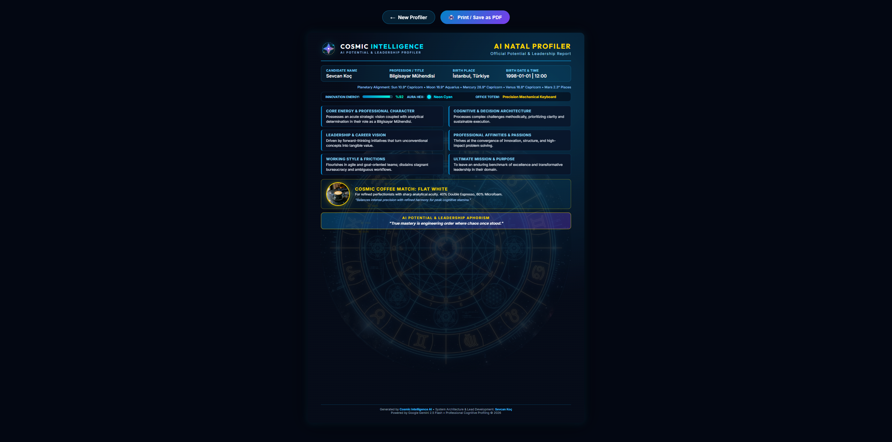
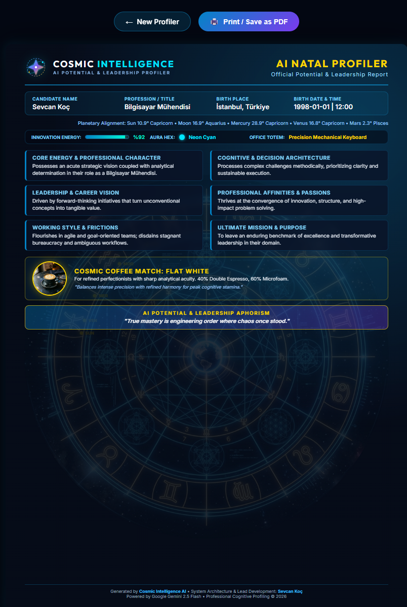

# Cosmic Intelligence 🌌 | AI Potential & Leadership Profiler

> 🚀 **Canlı Demoyu Deneyin (Try Live Demo):** **[https://sevcanncll.github.io/cosmic-intelligence-showcase/](https://sevcanncll.github.io/cosmic-intelligence-showcase/)**

---

## 📸 Ekran Görüntüleri & Canlı Görünüm (Screenshots)

  <h3>🌌 1. Kozmik Giriş & Bilişsel Profilleme Arayüzü</h3>
  

 

  <h3>📑 2. Baskıya Hazır Resmi A4 Profil Raporu & PDF Çıktısı</h3>
  

 

  <h3>⚡ 3. Çok Aşamalı Gerçek Zamanlı Yapay Zeka Analizi</h3>
  

---

## 🌟 Proje Vizyonu (Project Vision)

**Cosmic Intelligence**, bireylerin doğum haritası astrolojik efemeris koordinatları ile **mesleki pozisyonlarını ve çalışma dinamiklerini** bir araya getiren; bilişsel liderlik, kariyer potansiyeli ve profesyonel karakter haritası çıkaran yeni nesil yapay zeka profilleme platformudur.

Geleneksel astroloji/fal klişelerinden tamamen arındırılmış, modern iş dünyası, bilişsel karar mekanizmaları ve yönetici vizyonuna odaklanan resmi ve saygın bir dille tasarlanmıştır.

---

## 🎯 Kurumsal Uyarlanabilirlik & Etkinlik Entegrasyonu (B2B & Events)

Bu platform; **şirketlere, zirvelere, lansmanlara ve mesleki organizasyonlara** anında entegre edilebilir esnek bir altyapıya sahiptir:

* 🏢 **Kurumsal Şirketler & İK Zirveleri:** Yetenek yönetimi, yönetici kampları ve motivasyon günlerinde katılımcılara özel analizler sunar.
* 🎪 **Fuar, Zirve & Lansman Stantları:** Marka aktivasyonlarında ziyaretçilere unutulmaz ve kişiselleştirilmiş bir etkileşim deneyimi sağlar.
* 🖨️ **Baskıya Hazır Anında Çıktı (Print-Ready A4):** Analiz tamamlandığı anda stanttaki veya ofisteki yazıcıdan **tam A4 boyutunda resmi profil sertifikası** olarak yazdırılabilir veya PDF olarak indirilebilir.
* 👔 **Meslek Gruplarına Özel Dinamik Analiz:** Yazılımcılardan üst düzey yöneticilere kadar her meslek dalının çalışma temposuna, odak totemine ve kahve ihtiyacına özel çıktılar üretir.
* 🎨 **White-Label & Kolay Markalama:** Farklı bir etkinlik veya marka için logo, renk paleti ve promptlar kolayca uyarlanabilir.

---

## 🚀 Öne Çıkan Özellikler (Key Highlights)

- 🪐 **Saf PHP Astroloji & Efemeris Motoru:** Python/C bağımlılıkları olmadan Güneş, Ay, Merkür, Venüs ve Mars gezegen konumlarını ve burç derecelerini doğrudan PHP ile milimetrik hesaplar.
- ⚡ **Google Gemini 2.5 Flash Entegrasyonu:** Kişinin mesleğini ve astrolojik arketiplerini saniyeler içinde kurumsal zeka raporuna dönüştürür.
- ☕ **Mesleki Kahve, Aura & Totem Eşleşmesi:** Kişinin meslek temposuna uygun 11 gurme kahve arasından seçim, şanslı HEX aura rengi ve masaüstü odak totemi belirlenir.
- 🎨 **Modern & Prestijli Arayüz:** Cam morfizm (glassmorphism), fütüristik renk paleti, interaktif ses oynatıcı ve çift dil (TR / EN) desteği.
- 📱 **Sıfır Kesilme Garantili Vektörel Tipografi:** Tüm çözünürlüklerde ve baskı boyutlarında kusursuz görünüm.

---

## 🛠️ Kurulum & Yerel Çalıştırma (Setup)

1. Projeyi XAMPP `htdocs` klasörüne yerleştirin: `C:\xampp\htdocs\cosmic_intelligence`
2. `.env.example` dosyasını `.env` olarak kopyalayın ve Gemini API anahtarınızı girin.
3. XAMPP Control Panel üzerinden **Apache** servisini başlatın.
4. Tarayıcınızdan açın: `http://localhost/cosmic_intelligence/`

---

## 👩‍💻 Geliştirici & Sistem Mimarı (Author)

* **Sevcan Koç** — [GitHub Profili](https://github.com/sevcanncll)
* **Lisans:** MIT License
